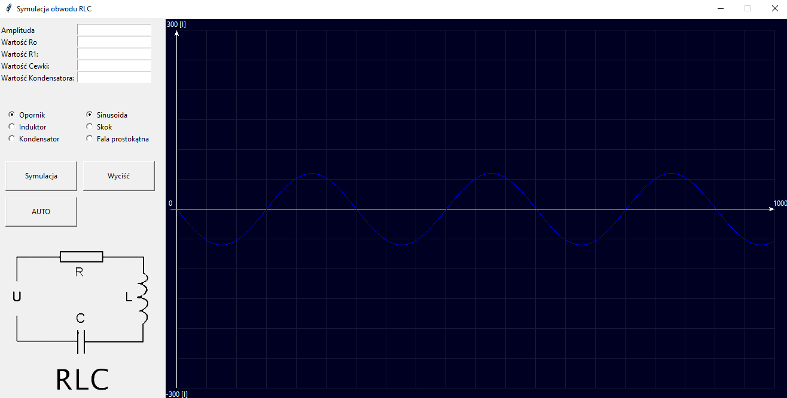

# Symulacja układu RLC #

## Uwaga!
Ten projekt był napisana rok temu w momencie, gdy do końca nie rozumiałem, jak pracują klasy.
Na dzień dzisiejszy ja bym korzystałem z innego podejścia do realizacji tego projekt! Na pewno zrobiłem by inną hierarchie klas, oraz przy możliwości zmieniłem by for na wywołanie generatorów. Co skutkowało by szybszemu działaniu programu oraz wykorzystanie pamięci RAM było by leprze. 

## Opis ##
Project był stworzony w ramach projektu studenckiego. Służy do 
symulacji pracy układu RLC oraz do wykresu przebiegu prądu. 
Program składa się z trzech części:
1) Oscyloskop, wykres przebiegu prądu w układzie.
2) Pole do podania odpowiednich parametrów 
3) Pole przycisków



## Code ##

#### main.py ####
Ten plik jest głównym w projekcie. Służy do stworzenia okna głównego 
oraz wywołania modułu ``Gui_Windows(root)``.
```python
from tkinter import *
from Modul.Gui_Windows import Gui_Windows

if __name__ == '__main__':
    # Create Window
    root = Tk()

    # Create object
    my_gui = Gui_Windows(root)

    root.mainloop()
```

#### Class/Gui_Windows.py ####
W tym module znajduje się klasa jaka służy do stworzenia interfejsu GUI.
```python
class Gui_Windows(object):
    def __init__(self, master):
        master.title("Symulacja obwodu RLC")
        master.geometry('1320x640')
        master.resizable(False, False)
        ... 
```
#### Class/congrol.py ####
Ten moduł odpowiada za logikę projektu. Składa się plik z klasy ``Control``
, każdy obiekt tej klasy posiada 5 zadawanych przez nas parametrów takich jak:
1) R0 and R1 - rezystancja 
2) A - Amplituda
3) L - Wartości cewki
4) C - Wartości opornika

oraz przekazywany obiekt Gui_Windows.

```python
class Control(object):

    def __init__(self, window, R0, R1, A, L, C):
        self.R0 = R0
        self.R1 = R1
        self.A = A
        self.L = L
        self.C = C
        Control.simulation(self, window)
```

###### Control.simulation(self, windows) #######
Odpowiednio do ustawionych przez nas parametrów wywołuje odpowiednią 
Funkcje klasy  Control
```python
    def simulation(self, windows):
        self.xy = []
        self.I = []

        if windows.sin != None:
            windows.canvas.delete(windows.sin)
        if windows.var.get() == 0:
            windows.messagebox.showinfo("Info", "Wybież jaki wykres redagować")
        elif windows.var.get() == 1:
            Control.Rezystor(self, windows, False)
        elif windows.var.get() == 2:
            Control.Cewka(self, windows)
        else:
            Control.Kondensator(self, windows)
        windows.sin = windows.canvas.create_line(self.xy, fill='blue')
```

###### Control.pobudzenie(windows, t, sygnal) #######
Zwraca pobudzenie (sinusoida, skok, fala prostokątna) dla odpowiedniego 
parametru t.

```python
def pobudzenie(windows, t, sygnal):
    if sygnal == 0:
        windows.messagebox.showinfo("Info", "Wybież jaki wykres redagować")
    elif sygnal == 1:
        return (math.sin(t * 0.0209))
    elif sygnal == 2:
        return (1)
    else:
        if (t / 100) % 2 <= 1:
            return (1)
        else:
            return (-1)
```

###### Control.Rezystor(self, windows, napiecie) #######
Funkcja przeprowadza symulacje dla Rezystora. Wartość R 
jest równa: `` R = R0 + R1 * math.exp((-1) * A * t) ``.
Odpowiednio prąd na rezystorze równy: ``I = U_we / R``.
```python
def Rezystor(self, windows, napiecie):
    for t in range(1000):
        U_we = Control.pobudzenie(windows, t, float(windows.var_1.get())) * self.A
        R = self.R0 + self.R1 * math.exp((-1) * self.A * t)
        I = U_we / R
        self.xy.append(t + 20)
        self.xy.append(I + 320)
```
###### Control.Cewka(self, windows) #######
###### Control.Kondensator(self, windows) #######

